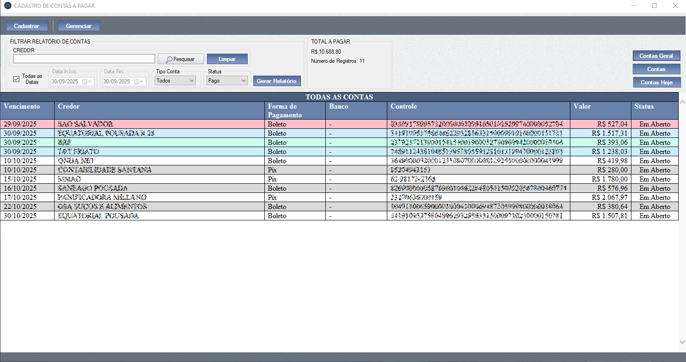
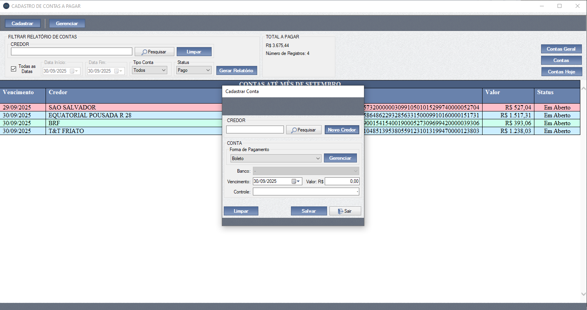
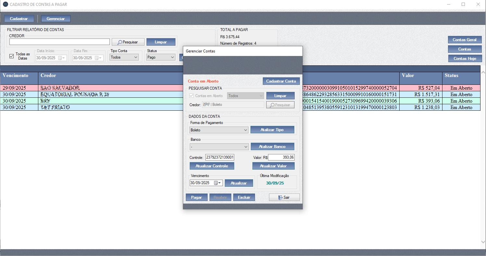

# Sistema de Gestão de Contas a Pagar - VB.NET Windows Forms

Sistema proprietário de gestão de contas a pagar, desenvolvido em **VB.NET** com **Windows Forms**.  
Este sistema foi criado originalmente para atender à necessidade do meu próprio negócio quando iniciei minha jornada empreendedora.

## 📋 Funcionalidades Principais
- Cadastro e gerenciamento de contas a pagar
- Cadastro e gerenciamento de Credores
- Relatórios de ocupação e faturamento

## 🛠️ Tecnologias Utilizadas
- **VB.NET** (.NET Framework)
- **Entity Framework**
- **Windows Forms**
- **SQL Server**

## 📸 Capturas de Tela

#### - Painel Principal

#### - Cadastro de Contas

#### - Gerenciar Contas

